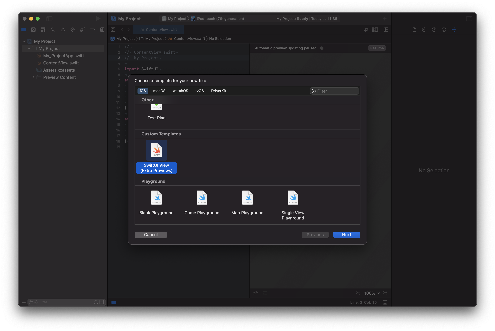
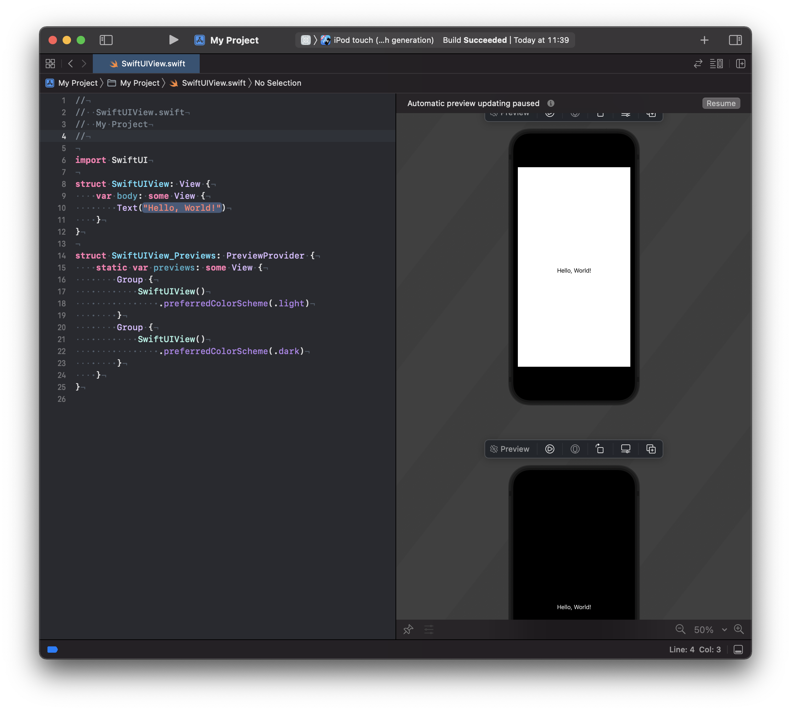

# XCode Templates
Just a few useful XCode templates.

## SwiftUI View with extra previews

This template very simple and it's the exact same as the _SwiftUI View_ template offered by Xcode with the addition that the auto-generated preview contains variations for light and dark mode.

## Hot to install Xcode templates

Copy the contents of `<template>.xctemplate` to `~/Library/Developer/Xcode/Templates/File Templates/Custom Templates`.

Create the `Custom Templates` folder if it doesn't exist. You can also name that folder whatever you want.
